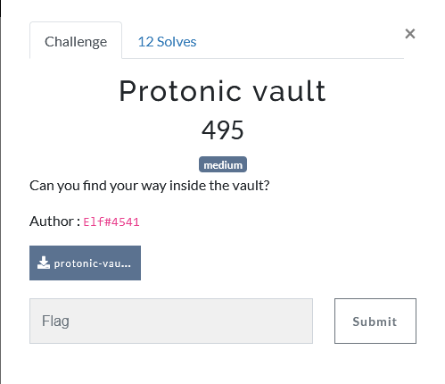
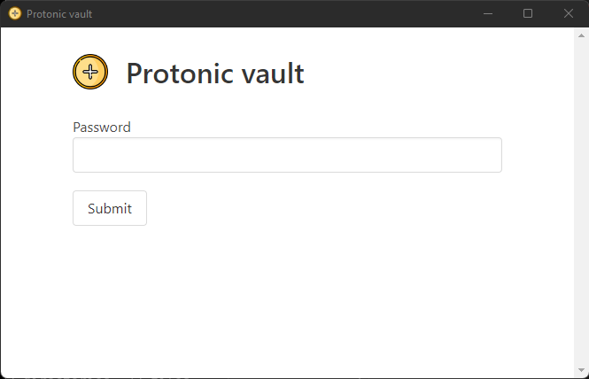
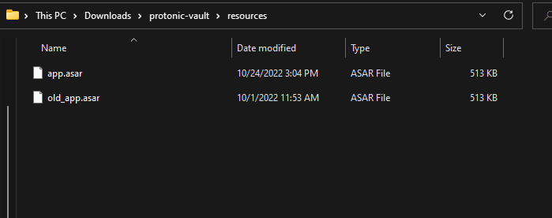
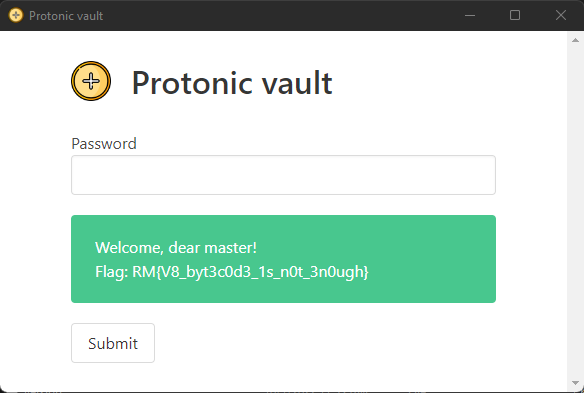

<center><h1> PROTONIC VAULT</h1></center>

Hello, today i will explain how i solve the Protonic Vault challenge from the Root-Me capture the flag.



```
user@debian:~/protonic_vault$ tree protonic-vault
protonic-vault
├── chrome_100_percent.pak
├── chrome_200_percent.pak
├── d3dcompiler_47.dll
├── ffmpeg.dll
├── icudtl.dat
├── libEGL.dll
├── libGLESv2.dll
├── LICENSE
├── LICENSES.chromium.html
├── locales
│   ├── af.pak
│   ├── am.pak
│   ├── ar.pak
│   ├── bg.pak
│   ├── bn.pak
│   ├── ca.pak
│   ├── cs.pak
│   ├── da.pak
[...]
│   ├── te.pak
│   ├── th.pak
│   ├── tr.pak
│   ├── uk.pak
│   ├── ur.pak
│   ├── vi.pak
│   ├── zh-CN.pak
│   └── zh-TW.pak
├── protonic-vault.exe
├── resources
│   └── app.asar
├── resources.pak
├── snapshot_blob.bin
├── v8_context_snapshot.bin
├── version
├── vk_swiftshader.dll
├── vk_swiftshader_icd.json
└── vulkan-1.dll
```
We uncompress the protonic-vault.zip file given for this challenge and execute protonic-vault.exe.



The application ask you a password. Obviously, we don't know the password. I tried to reverse engineer this executable but it was hard. So i decided to look at the other files. The resources/app.asar file seems interesting. After some google research I deduced that this application was an electron application. We can found the official github of Asar here : https://github.com/electron/asar

So let's decompile this app.asar file !

We must first install asar. We can do it with this command.
```
npm install --engine-strict @electron/asar
```
and now let's extract this archive.
```
user@debian:~/protonic_vault/protonic-vault/resources$ asar --help
Usage: asar [options] [command]

Manipulate asar archive files

Options:
  -V, --version                         output the version number
  -h, --help                            display help for command

Commands:
  pack|p [options] <dir> <output>       create asar archive
  list|l [options] <archive>            list files of asar archive
  extract-file|ef <archive> <filename>  extract one file from archive
  extract|e <archive> <dest>            extract archive
  *
  help [command]                        display help for command
user@debian:~/protonic_vault/protonic-vault/resources$ asar extract app.asar app_extracted
user@debian:~/protonic_vault/protonic-vault/resources$ ls
app.asar  app_extracted
user@debian:~/protonic_vault/protonic-vault/resources$ ls app_extracted/
img  index.html  node_modules  package.json  src  styles
```
Nice ! We have the source code of our application. The src/ folder seems interesting.
```
src/
├── main.js
├── preload.js
├── renderer.js
└── window.jsc
```
In the renderer.js file we can recognize our login form.
```js
async function setupHandler() {
    let truePassword = await window.electronAPI.getPassword()

    document.getElementById("passForm").addEventListener("submit", async e => {
        e.preventDefault()

        const passwordInput = document.getElementById("password")
        const password = passwordInput.value
        const resultDiv = document.getElementById("result")

        resultDiv.hidden = false

        if (password === truePassword) {
            resultDiv.innerHTML = `Welcome, dear master!<br/>Flag: ${await window.electronAPI.getFlag()}`
            resultDiv.className = "notification is-success"
        }
        else {
            resultDiv.textContent = "You're wrong!!"
            resultDiv.className = "notification is-danger"
        }
    })
}

setupHandler()
```
The method ``window.electronAPI.getPassword()`` ask for the password. It means that our password is located in the window.jsc file, but this file is compiled into v8 bytecode (https://fr.wikipedia.org/wiki/V8_(moteur_JavaScript)). I was very lazy to decompile it so I had another idea. If we patch the renderer.js file and compile it again into an other app.asar will this work? I tried. This is our new renderer.js file.

```js
async function setupHandler() {
    let truePassword = await window.electronAPI.getPassword()

    document.getElementById("passForm").addEventListener("submit", async e => {
        e.preventDefault()

        const passwordInput = document.getElementById("password")
        const password = passwordInput.value
        const resultDiv = document.getElementById("result")

        resultDiv.hidden = false

        resultDiv.innerHTML = `Welcome, dear master!<br/>Flag: ${await window.electronAPI.getFl>
        resultDiv.className = "notification is-success"
    })
}

setupHandler()
```
I just removed the condition.
We compile again our application patched.
```
user@debian:~/protonic_vault/protonic-vault/resources$ asar pack app_extracted/ new_app.asar
```
and we replace the old app.asar with our new file.



and we executed again the protonic-vault.exe, click on submit with any password and it works ! we are login and we can get the flag.



Flag : RM{V8_byt3c0d3_1s_n0t_3n0ugh}

Thanks to Root-Me and Elf for this challenge. Was very interesting because it was the first time I reverse engineer this type of application.